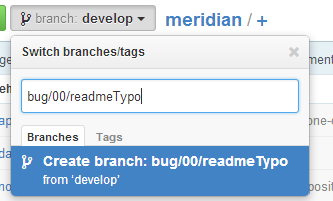

# Contributing

#### Non-Government
Contributions to the baseline project from outside the US Federal Government should be submitted as a pull request to the core project on GitHub.  Before patches will be accepted by the core project, contributors have a signed [Contributor License Agreement](https://www.ozoneplatform.org/ContributorLicenseAgreement1-3OZONE.docx) on file with the core team.  If you or your company wish your copyright in your contribution to be annotated in the project documentation (such as this README), then your pull request should include that annotation.
 
#### Government
Contributions from government agencies do not need to have a CLA on file, but do require verification that the government has unlimited rights to the contribution.  An email to goss-support@owfgoss.org is sufficient, stating that the contribution was developed by an employee of the United States Government in the course of his or her duties. Alternatively, if the contribution was developed by a contractor, the email should provide the name of the Contractor, Contract number, and an assertion that the contract included the standard "Unlimited rights" clause specified by [DFARS 252.227.7014](http://www.acq.osd.mil/dpap/dars/dfars/html/current/252227.htm#252.227-7014) "Rights in noncommercial computer software and noncommercial computer software documentation".
 
Government agencies are encouraged to submit contributions as pull requests on GitHub.

## Issue submission

In order for us to help you please check that you've completed the following steps:
* Made sure you're on the latest version.
* Used the search feature to ensure that the issue (bug, enhancement, etc.) hasn't been reported before.
* Included as much information about the issue as possible, including any output you've received, what OS and version you're on, etc.  
* Only add the `0 - Backlog` label and the type of issue it is (enhancement, bug, etc.)
  
[Submit your issue](https://github.com/ozone-development/meridian/issues/new)

## Style Guide

The [Meridian JavaScript Style Guide](./app/docs/javascript-styleguide#meridian-javascript-style-guide-forked-from-airbnb) is still under review by our developers.

Please ensure any pull requests follow this closely. If you notice existing code which doesn't follow these practices, feel free to shout and we will address this.

## Pull Request Guidelines

* Make sure to comply with our [Non-Government](./contributing.md#non-government) and [Government](./contributing.md#government) instructions for contributions
* Please check to make sure that there aren't existing pull requests attempting to address the issue mentioned. We also recommend checking for related issues on the tracker, as a team member may be working on the issue in a branch or fork
* Non-trivial changes should be discussed in an issue first
* All branches should address an open issue found on the [tracker](https://github.com/ozone-development/meridian/issues?state=open)
* Always create your branch from the lates develop branch, not master or any other branch. To do this, switch to the develop branch before creating the branch and github handles the rest
* All branches must follow this naming convention to be even considered: **(type of issue)/(issue number)/(short description)** 

</img>

* Follow the [Meridian JavaScript Style Guide](./app/docs/javascript-styleguide#meridian-javascript-style-guide-forked-from-airbnb/README.md) closely
* Lint the code
